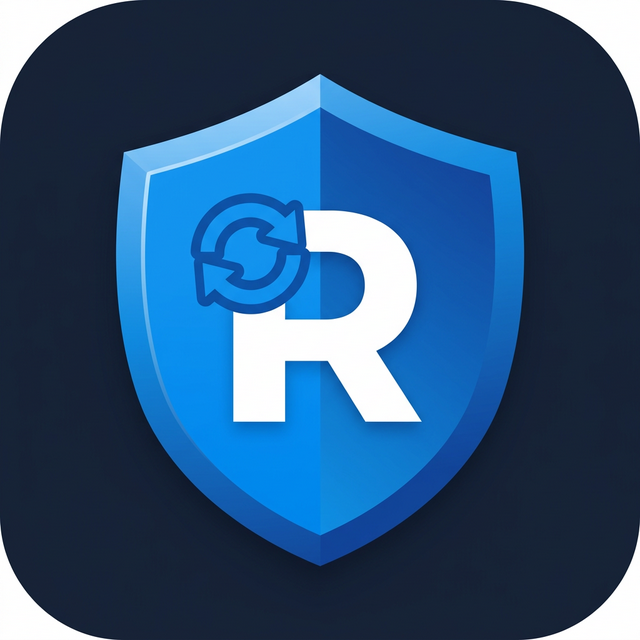
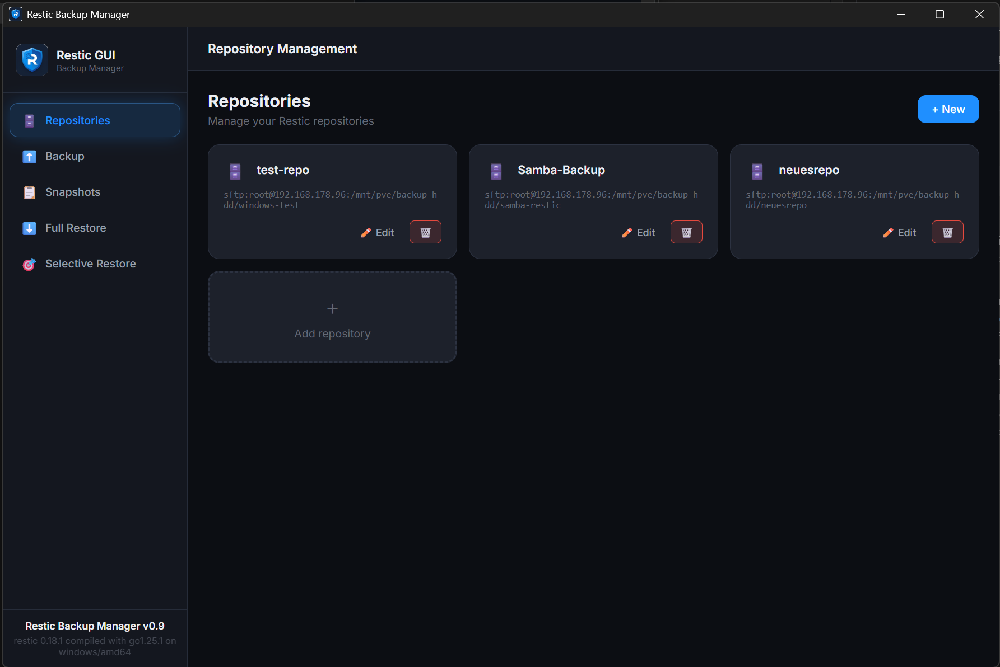
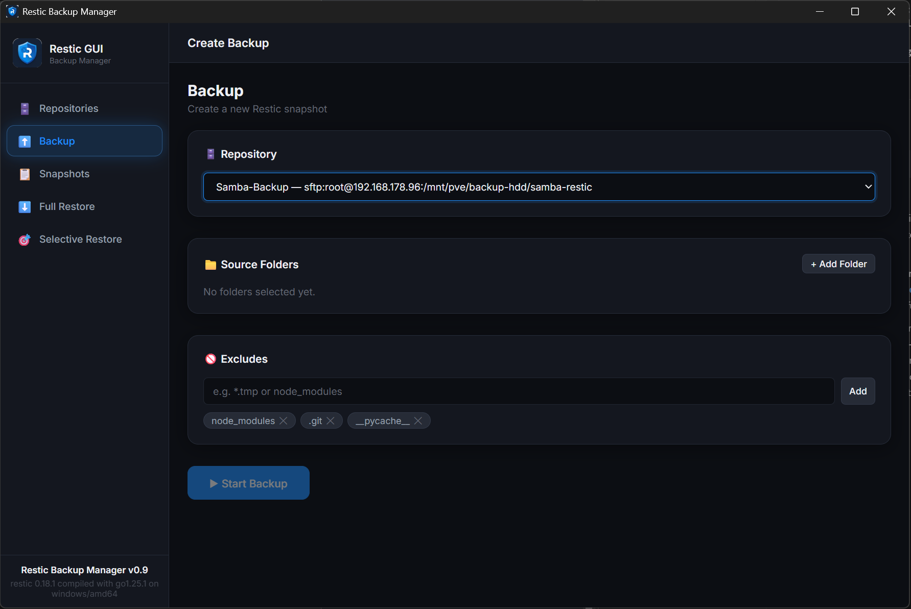

# Restic Backup Manager

<p align="center">
  
</p>

<p align="center">
  <strong>A modern, cross-platform GUI for <a href="https://restic.net">restic</a> backups — built with Go + React + Wails</strong>
</p>

<p align="center">
  
  
  
  
</p>

---

## ✨ Features

- 🗄️ **Multiple repositories** — manage local, SFTP, S3 and other restic backends
- ⬆️ **Backup** — select source folders, define excludes, live progress
- 📋 **Snapshots** — browse, view and delete snapshots
- ⬇️ **Full Restore** — restore an entire snapshot to any target folder
- 🎯 **Selective Restore** — browse snapshot contents with checkboxes, restore individual files/folders
  - Restore to **original path** (fast, same-drive temp → rename)
  - Restore to **custom folder**
- 🌍 **Fully English UI** — ready for international use
- 📦 **Single portable `.exe`** — no installation needed

---

## 🚀 Getting Started

### Requirements

- **Windows 10 / 11** (WebView2 is required — pre-installed on Win10 21H1+)
- **[restic](https://restic.net)** — the backup engine

### Install restic

```powershell
winget install restic
```

Or download it from [https://restic.net](https://restic.net) and place `restic.exe` next to `ResticBackupManager.exe`.

### Run

Just double-click `ResticBackupManager.exe`. No installer, no setup.

---

## 📸 Screenshots

<p align="center">
  
</p>
<p align="center">
  
</p>
<p align="center">
  
</p>

---

## 🔧 Build from source

### Prerequisites

- [Go 1.21+](https://go.dev/dl/)
- [Node.js 18+](https://nodejs.org/)
- [Wails v2](https://wails.io/docs/gettingstarted/installation)

```powershell
# Install Wails CLI
go install github.com/wailsapp/wails/v2/cmd/wails@latest

# Clone and build
git clone https://github.com/NeverBeLazyG/restic-backup-manager.git
cd restic-backup-manager

wails build -platform windows/amd64 -trimpath -ldflags "-s -w"
```

The output will be at `build/bin/ResticBackupManager.exe`.

---

## 🏗️ Tech Stack

| Layer | Technology |
|---|---|
| Backend | Go + [Wails v2](https://wails.io) |
| Frontend | React 18 + TypeScript + Vite |
| Backup engine | [restic](https://restic.net) |
| Styling | Vanilla CSS (dark glassmorphism theme) |

---

## 📄 License

MIT — see [LICENSE](LICENSE)

---

## 🙏 Credits

- [restic](https://restic.net) — the fantastic backup engine powering this tool
- [Wails](https://wails.io) — Go + Web desktop framework
